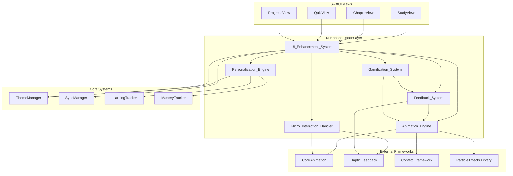

# Design Document: UI/UX Enhancement System

## Overview

The UI/UX Enhancement System transforms the Japanese language learning iOS app into a "cool and sick" experience through advanced visual effects, engaging micro-interactions, and personalized experiences. Building upon the existing comprehensive theming system (30+ themes) and Liquid Glass effects, this system introduces cutting-edge design patterns, sophisticated animations, and gamification elements while maintaining educational effectiveness and accessibility.

The enhancement system is designed as a modular, performance-conscious architecture that seamlessly integrates with existing features while providing granular user control over visual effects. The system leverages modern SwiftUI capabilities, Core Animation, and iOS haptic feedback to create an immersive learning environment that motivates students through visual delight and responsive interactions.

## Architecture

### System Architecture Diagram



### Component Responsibilities

**UI_Enhancement_System**: Central coordinator that manages all enhancement components, handles user preferences, and ensures performance optimization across the system.

**Animation_Engine**: Manages complex animations including particle effects, transitions, morphing elements, and celebration animations using Core Animation and third-party libraries.

**Micro_Interaction_Handler**: Handles small, delightful interactions including haptic feedback, button responses, hover effects, and gesture-based animations.

**Personalization_Engine**: Analyzes user behavior and learning patterns to adapt the interface, suggest optimal study times, and unlock progressive visual enhancements.

**Gamification_System**: Manages achievement tracking, progress visualization, streak indicators, and reward animations to maintain user motivation.

**Feedback_System**: Provides immediate visual and haptic feedback for all user actions, ensuring responsive and connected interactions.

## Components and Interfaces

### UI_Enhancement_System

```swift
class UIEnhancementSystem: ObservableObject {
    @Published var enhancementLevel: EnhancementLevel = .balanced
    @Published var isEnabled: Bool = true
    @Published var customSettings: EnhancementSettings
    
    private let animationEngine: AnimationEngine
    private let microInteractionHandler: MicroInteractionHandler
    private let personalizationEngine: PersonalizationEngine
    private let gamificationSystem: GamificationSystem
    private let feedbackSystem: FeedbackSystem
    
    func applyEnhancement(to view: AnyView, context: EnhancementContext) -> AnyView
    func updateSettings(_ settings: EnhancementSettings)
    func getPerformanceMetrics() -> PerformanceMetrics
}

enum EnhancementLevel: String, CaseIterable {
    case minimal, balanced, maximum
    
    var animationIntensity: Float { /* implementation */ }
    var particleCount: Int { /* implementation */ }
    var hapticIntensity: UIImpactFeedbackGenerator.FeedbackStyle { /* implementation */ }
}

struct EnhancementSettings: Codable {
    var enableParticleEffects: Bool = true
    var enableHapticFeedback: Bool = true
    var enableCelebrationAnimations: Bool = true
    var enableMorphingElements: Bool = true
    var enableGlassmorphism: Bool = true
    var enableNeumorphism: Bool = false
    var batteryOptimization: Bool = true
    var accessibilityMode: Bool = false
}
```

### Animation_Engine

```swift
class AnimationEngine: ObservableObject {
    private let particleSystem: ParticleSystem
    private let transitionManager: TransitionManager
    private let celebrationAnimator: CelebrationAnimator
    
    func createSplashAnimation() -> AnyView
    func createTransition(from: AnyView, to: AnyView, style: TransitionStyle) -> AnyTransition
    func createCelebrationEffect(type: CelebrationType, intensity: Float) -> AnyView
    func createMorphingCard(content: AnyView, morphStyle: MorphStyle) -> AnyView
    func createParallaxEffect(backgroundView: AnyView, foregroundView: AnyView) -> AnyView
}

enum TransitionStyle {
    case fluidSlide, depthPush, morphTransform, liquidFlow
}

enum CelebrationType {
    case confetti, sparkles, fireworks, ripple, glow
}

enum MorphStyle {
    case cardToDetail, listToGrid, compactToExpanded
}
```

### Micro_Interaction_Handler

```swift
class MicroInteractionHandler: ObservableObject {
    private let hapticGenerator: UIImpactFeedbackGenerator
    private let selectionGenerator: UISelectionFeedbackGenerator
    private let notificationGenerator: UINotificationFeedbackGenerator
    
    func handleButtonTap(style: ButtonStyle, intensity: HapticIntensity)
    func handleHover(element: UIElement) -> AnyView
    func handleSwipeGesture(direction: SwipeDirection, velocity: CGFloat) -> SwipeResponse
    func handlePullToRefresh(progress: CGFloat) -> AnyView
    func createRippleEffect(at location: CGPoint, color: Color) -> AnyView
}

enum HapticIntensity {
    case light, medium, heavy, custom(UIImpactFeedbackGenerator.FeedbackStyle)
}

struct SwipeResponse {
    let animation: AnyView
    let hapticFeedback: HapticIntensity
    let visualFeedback: VisualFeedback
}
```

### Personalization_Engine

```swift
class PersonalizationEngine: ObservableObject {
    @Published var userProfile: UserProfile
    @Published var adaptiveSettings: AdaptiveSettings
    
    private let behaviorAnalyzer: BehaviorAnalyzer
    private let preferencePredictor: PreferencePredictor
    
    func analyzeStudyPatterns() -> StudyPatternAnalysis
    func suggestOptimalStudyTime() -> TimeRange
    func adaptInterfaceForUser() -> InterfaceAdaptation
    func unlockProgressiveEnhancements() -> [Enhancement]
    func scheduleAdaptiveChanges() -> [ScheduledChange]
}

struct UserProfile: Codable {
    var studyPatterns: [StudyPattern]
    var preferredSubjects: [Subject]
    var performanceMetrics: PerformanceMetrics
    var visualPreferences: VisualPreferences
    var achievementLevel: AchievementLevel
}

struct InterfaceAdaptation {
    let layoutChanges: [LayoutChange]
    let colorAdjustments: [ColorAdjustment]
    let animationModifications: [AnimationModification]
    let contentPrioritization: [ContentPriority]
}
```

### Gamification_System

```swift
class GamificationSystem: ObservableObject {
    @Published var currentStreak: Int = 0
    @Published var experiencePoints: Int = 0
    @Published var achievements: [Achievement] = []
    @Published var currentLevel: Level = .beginner
    
    private let achievementTracker: AchievementTracker
    private let progressVisualizer: ProgressVisualizer
    private let rewardAnimator: RewardAnimator
    
    func awardExperiencePoints(_ points: Int, for activity: StudyActivity) -> AnyView
    func updateStreak() -> StreakUpdateResult
    func checkAchievements() -> [Achievement]
    func createProgressVisualization(for metric: ProgressMetric) -> AnyView
    func createRewardAnimation(for reward: Reward) -> AnyView
}

enum Level: String, CaseIterable {
    case beginner, intermediate, advanced, expert, master
    
    var visualTheme: VisualTheme { /* implementation */ }
    var unlockedFeatures: [Feature] { /* implementation */ }
}

struct Achievement: Identifiable, Codable {
    let id: UUID
    let title: String
    let description: String
    let icon: String
    let rarity: Rarity
    let unlockedDate: Date?
    let celebrationAnimation: CelebrationType
}
```

### Feedback_System

```swift
class FeedbackSystem: ObservableObject {
    private let visualFeedbackGenerator: VisualFeedbackGenerator
    private let hapticFeedbackManager: HapticFeedbackManager
    private let audioFeedbackManager: AudioFeedbackManager
    
    func provideImmediateFeedback(for action: UserAction) -> FeedbackResponse
    func createLoadingFeedback(estimatedDuration: TimeInterval) -> AnyView
    func createErrorFeedback(error: AppError) -> AnyView
    func createSuccessFeedback(success: SuccessType) -> AnyView
    func createProgressFeedback(progress: Float) -> AnyView
}

struct FeedbackResponse {
    let visual: VisualFeedback
    let haptic: HapticFeedback
    let audio: AudioFeedback?
    let duration: TimeInterval
}

enum VisualFeedback {
    case glow(Color, intensity: Float)
    case ripple(Color, radius: CGFloat)
    case shake(intensity: Float)
    case bounce(scale: CGFloat)
    case colorFlash(Color, duration: TimeInterval)
}
```

## Data Models

### Enhancement Configuration

```swift
struct EnhancementConfiguration: Codable {
    let version: String = "1.0"
    var globalSettings: GlobalEnhancementSettings
    var componentSettings: ComponentEnhancementSettings
    var performanceSettings: PerformanceSettings
    var accessibilitySettings: AccessibilityEnhancementSettings
}

struct GlobalEnhancementSettings: Codable {
    var enhancementLevel: EnhancementLevel = .balanced
    var isEnabled: Bool = true
    var batteryOptimizationEnabled: Bool = true
    var reducedMotionCompliance: Bool = true
}

struct ComponentEnhancementSettings: Codable {
    var animations: AnimationSettings
    var microInteractions: MicroInteractionSettings
    var gamification: GamificationSettings
    var personalization: PersonalizationSettings
}

struct AnimationSettings: Codable {
    var enableParticleEffects: Bool = true
    var enableTransitions: Bool = true
    var enableCelebrations: Bool = true
    var particleCount: Int = 50
    var animationDuration: TimeInterval = 0.3
    var springDamping: CGFloat = 0.8
    var springResponse: CGFloat = 0.4
}

struct PerformanceSettings: Codable {
    var maxFrameRate: Int = 60
    var enableBatteryOptimization: Bool = true
    var enableThermalThrottling: Bool = true
    var maxConcurrentAnimations: Int = 5
    var enableGPUAcceleration: Bool = true
}
```

### User Behavior Analytics

```swift
struct UserBehaviorData: Codable {
    let userId: String
    var sessionData: [StudySession]
    var interactionPatterns: [InteractionPattern]
    var preferenceHistory: [PreferenceChange]
    var performanceMetrics: UserPerformanceMetrics
}

struct StudySession: Codable, Identifiable {
    let id: UUID
    let startTime: Date
    let endTime: Date
    let subject: Subject
    let activitiesCompleted: [StudyActivity]
    let effectivenessScore: Float
    let engagementLevel: EngagementLevel
}

struct InteractionPattern: Codable {
    let gestureType: GestureType
    let frequency: Int
    let averageResponseTime: TimeInterval
    let preferredIntensity: Float
    let contextualUsage: [ContextualUsage]
}

enum EngagementLevel: String, Codable, CaseIterable {
    case low, medium, high, exceptional
    
    var visualIntensityMultiplier: Float {
        switch self {
        case .low: return 0.5
        case .medium: return 1.0
        case .high: return 1.5
        case .exceptional: return 2.0
        }
    }
}
```

### Visual Effect Definitions

```swift
struct VisualEffect: Identifiable, Codable {
    let id: UUID
    let name: String
    let type: EffectType
    let parameters: EffectParameters
    let triggers: [EffectTrigger]
    let duration: TimeInterval
    let intensity: Float
}

enum EffectType: String, Codable, CaseIterable {
    case particle, transition, morphing, glow, ripple, shake, bounce, colorShift
}

struct EffectParameters: Codable {
    var colors: [String] = []
    var sizes: [CGFloat] = []
    var positions: [CGPoint] = []
    var velocities: [CGVector] = []
    var customProperties: [String: Any] = [:]
}

enum EffectTrigger: String, Codable, CaseIterable {
    case onAppear, onTap, onSwipe, onSuccess, onError, onProgress, onAchievement, onStreak
}
```

## Correctness Properties

*A property is a characteristic or behavior that should hold true across all valid executions of a system—essentially, a formal statement about what the system should do. Properties serve as the bridge between human-readable specifications and machine-verifiable correctness guarantees.*

Before writing the correctness properties, I need to analyze the acceptance criteria from the requirements to determine which ones are testable as properties.

<function_calls>
<invoke name="prework">
<parameter name="featureName">ui-ux-enhancement

### Core Animation Properties

**Property 1: Universal Animation Enhancement**
*For any* UI element that supports animation, when enhancement is enabled, the element should display smooth animations with appropriate easing curves and timing
**Validates: Requirements 1.2, 1.3, 1.5, 1.6, 1.7**

**Property 2: Celebration Animation Consistency**
*For any* study activity completion or achievement, the system should trigger celebration animations with visual effects appropriate to the achievement level
**Validates: Requirements 1.4, 2.8, 5.3**

**Property 3: Error Animation Response**
*For any* error condition, the system should provide gentle shake animations and appropriate color transitions to indicate the error state
**Validates: Requirements 1.8, 6.4**

### Micro-Interaction Properties

**Property 4: Immediate Feedback Response**
*For any* user interaction (tap, swipe, hover), the system should provide immediate visual and haptic feedback within the specified timing constraints
**Validates: Requirements 2.1, 2.2, 2.5, 2.6, 2.7, 6.3**

**Property 5: Physics-Based Interaction**
*For any* swipe or gesture interaction, the system should respond with realistic physics-based movements that match the input velocity and direction
**Validates: Requirements 2.3, 7.2, 7.3**

### Personalization Properties

**Property 6: Adaptive Interface Behavior**
*For any* user with established patterns or preferences, the system should adapt the interface to emphasize relevant content and provide appropriate visual complexity
**Validates: Requirements 3.2, 3.4, 3.7, 7.8**

**Property 7: Progressive Enhancement Unlocking**
*For any* user achievement or performance milestone, the system should unlock appropriate visual enhancements and provide enhanced recognition
**Validates: Requirements 3.3, 3.5, 3.6**

**Property 8: Time-Based Adaptation**
*For any* user with adaptive themes enabled, the system should automatically adjust visual elements based on time of day and scheduled preferences
**Validates: Requirements 3.8, 10.6**

### Visual Enhancement Properties

**Property 9: Modern Design Pattern Application**
*For any* UI component, when enhancement is enabled, the component should apply appropriate modern design patterns (glassmorphism, neumorphism, gradient meshes) based on its context
**Validates: Requirements 4.1, 4.2, 4.3, 4.5**

**Property 10: Interactive Element Enhancement**
*For any* interactive element (buttons, FABs, menus), the element should display enhanced behaviors like magnetic attraction, morphing, and contextual responses
**Validates: Requirements 4.4, 7.1, 7.4, 7.7**

**Property 11: Typography and Layout Scaling**
*For any* content with varying importance levels, the typography and layout should scale appropriately to reflect content hierarchy and user preferences
**Validates: Requirements 4.7, 4.5**

### Gamification Properties

**Property 12: Progress Visualization Consistency**
*For any* progress metric or achievement, the system should provide animated visual representations that accurately reflect the current state and changes
**Validates: Requirements 5.1, 5.2, 5.4, 5.6**

**Property 13: Reward Presentation Animation**
*For any* earned reward or unlocked achievement, the system should present it with appropriate celebration animations and visual effects
**Validates: Requirements 5.3, 5.7**

**Property 14: Competitive Element Animation**
*For any* competitive feature (leaderboards, challenges), the system should provide animated rankings and dynamic challenge presentations
**Validates: Requirements 5.5**

### Feedback System Properties

**Property 15: Visual Continuity Maintenance**
*For any* navigation or content change, the system should maintain visual continuity through shared element transitions and context preservation
**Validates: Requirements 6.1, 6.6**

**Property 16: Loading State Accuracy**
*For any* loading operation, the system should display skeleton screens or progress indicators that accurately represent the final content layout and completion progress
**Validates: Requirements 6.2, 6.5**

**Property 17: Real-Time Interaction Feedback**
*For any* gesture or voice input, the system should provide real-time visual tracking and feedback that corresponds to the input being processed
**Validates: Requirements 6.7, 6.8**

### Performance and Accessibility Properties

**Property 18: Performance Maintenance**
*For any* animation or visual effect, when enabled on supported devices, the system should maintain target frame rates and respond to performance constraints
**Validates: Requirements 8.1, 8.6**

**Property 19: Accessibility Alternative Provision**
*For any* visual element or interaction, when accessibility features are enabled, the system should provide appropriate alternatives and enhanced indicators
**Validates: Requirements 8.2, 8.4, 8.8**

### Integration Properties

**Property 20: Feature Enhancement Preservation**
*For any* existing app feature (flashcards, quizzes, timers, etc.), the enhancement system should integrate seamlessly while preserving all original functionality
**Validates: Requirements 9.1, 9.2, 9.3, 9.4, 9.5, 9.7, 9.8**

**Property 21: Theme Compatibility**
*For any* theme change or visual enhancement, all enhanced effects should remain functional and visually appropriate across different themes
**Validates: Requirements 9.6**

### Customization Properties

**Property 22: Settings Control Granularity**
*For any* enhancement setting or preference, the system should provide granular control and immediate visual feedback for adjustments
**Validates: Requirements 10.2, 10.5, 10.7**

**Property 23: Preference Persistence**
*For any* user preference or setting change, the system should persist the configuration across app sessions and device changes
**Validates: Requirements 10.4**

## Error Handling

### Error Categories and Responses

**Animation Failures**
- Graceful degradation to simpler animations when complex effects fail
- Fallback to static states when animation resources are unavailable
- Performance monitoring to detect and respond to animation bottlenecks

**Resource Constraints**
- Automatic reduction of visual effects when memory or battery is limited
- Dynamic quality adjustment based on device capabilities
- Intelligent caching of animation assets and particle systems

**User Preference Conflicts**
- Resolution of conflicting accessibility and enhancement settings
- Clear communication when features are disabled due to system constraints
- Preservation of core functionality when enhancements are unavailable

### Error Recovery Strategies

```swift
enum EnhancementError: Error, LocalizedError {
    case animationResourceUnavailable
    case performanceThresholdExceeded
    case incompatibleAccessibilitySettings
    case insufficientSystemResources
    
    var errorDescription: String? {
        switch self {
        case .animationResourceUnavailable:
            return "Animation resources temporarily unavailable"
        case .performanceThresholdExceeded:
            return "Reducing visual effects to maintain performance"
        case .incompatibleAccessibilitySettings:
            return "Some visual effects disabled for accessibility"
        case .insufficientSystemResources:
            return "Limited visual effects due to system constraints"
        }
    }
    
    var recoveryStrategy: RecoveryStrategy {
        switch self {
        case .animationResourceUnavailable:
            return .fallbackToStatic
        case .performanceThresholdExceeded:
            return .reduceComplexity
        case .incompatibleAccessibilitySettings:
            return .useAlternatives
        case .insufficientSystemResources:
            return .gracefulDegradation
        }
    }
}

enum RecoveryStrategy {
    case fallbackToStatic
    case reduceComplexity
    case useAlternatives
    case gracefulDegradation
    case retryWithDelay
}
```

## Testing Strategy

### Dual Testing Approach

The UI/UX Enhancement System requires both **unit testing** and **property-based testing** to ensure comprehensive coverage and correctness:

**Unit Tests** focus on:
- Specific animation sequences and their expected outcomes
- Individual micro-interaction responses and timing
- Error handling scenarios and recovery mechanisms
- Integration points with existing app features
- Accessibility compliance for specific UI elements
- Performance benchmarks for critical animation paths

**Property-Based Tests** focus on:
- Universal behavior across all UI elements and interactions
- Consistency of visual effects across different themes and contexts
- Performance characteristics under varying system conditions
- Accessibility compliance across all possible user configurations
- Personalization behavior with diverse user patterns and preferences

### Property-Based Testing Configuration

**Framework Selection**: Use Swift's built-in testing framework combined with a property-based testing library such as SwiftCheck or a custom implementation using Swift's randomization capabilities.

**Test Configuration**:
- Minimum **100 iterations** per property test to ensure comprehensive coverage
- Each property test must reference its corresponding design document property
- Tag format: **Feature: ui-ux-enhancement, Property {number}: {property_text}**

**Example Property Test Structure**:
```swift
func testUniversalAnimationEnhancement() {
    // Feature: ui-ux-enhancement, Property 1: Universal Animation Enhancement
    property("All UI elements with animation support display smooth animations") <- forAll { (element: UIElement) in
        let enhancedElement = uiEnhancementSystem.applyEnhancement(to: element)
        return enhancedElement.hasAnimation && 
               enhancedElement.animationCurve.isSmooth &&
               enhancedElement.animationTiming.isAppropriate
    }
}
```

### Testing Categories

**Visual Regression Testing**:
- Automated screenshot comparison for consistent visual output
- Animation frame analysis for smooth transitions
- Color accuracy testing across different themes and accessibility modes

**Performance Testing**:
- Frame rate monitoring during complex animations
- Memory usage tracking for particle systems and visual effects
- Battery impact measurement for different enhancement levels

**Accessibility Testing**:
- VoiceOver compatibility verification
- High contrast mode validation
- Reduced motion compliance testing
- Color vision difference accommodation testing

**Integration Testing**:
- Compatibility with existing app features
- Theme switching behavior validation
- Data persistence across app lifecycle events
- Cross-device synchronization of preferences

### Test Data Generation

**Synthetic User Patterns**:
- Generate diverse study session patterns for personalization testing
- Create varied interaction sequences for micro-interaction validation
- Simulate different device capabilities and constraints

**Visual Effect Validation**:
- Automated detection of animation smoothness and timing
- Color contrast ratio calculations for accessibility compliance
- Performance metric collection under various system loads

**Edge Case Coverage**:
- Low battery scenarios and automatic effect reduction
- Rapid theme switching and visual consistency maintenance
- Extreme user preference combinations and conflict resolution
- Network connectivity issues during synchronization operations